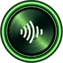

# Home Assistant Apps

A collection of vibed coded apps to optimize your HA setup.

| App  |     | Description |
|------|-----|-------------|
| **[Dasher](app-dasher/)** |  | WebSocket proxy that filters state updates for dashboard entities, improving performance for low-powered devices |
| **[Greenroom](app-greenroom/)** | | Spotify Connect monitor that publishes playback info to MQTT without requiring the Web API |
| **[Shack](app-shack/)** |  | Run HACS integrations outside HA core via MQTT discovery |

## Use of AI

These were heavily guided but ultimately vibe-coded for my own needs.  They're in active early development with frequent updates, and I use them all daily.  If that's not your thing, understood!